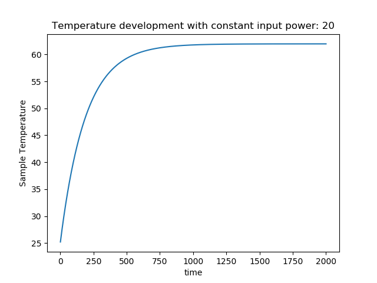
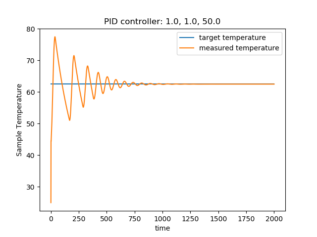
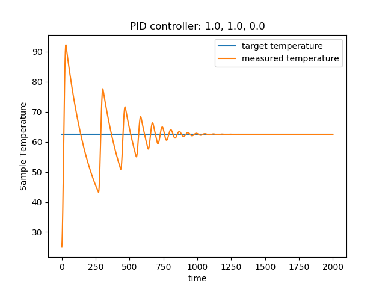
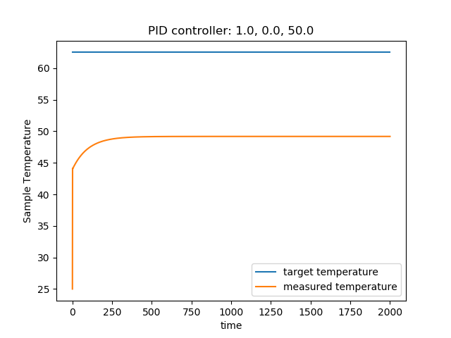
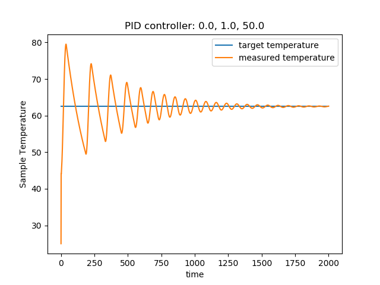
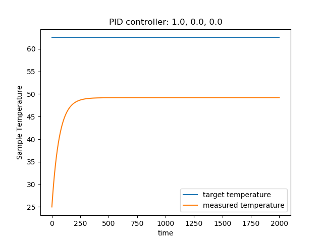
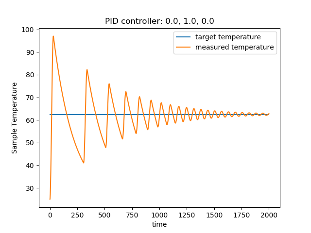
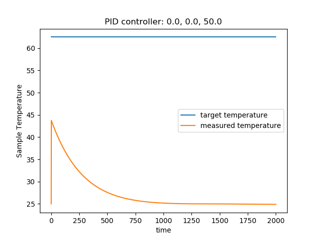
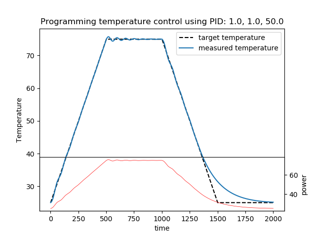

In this notebook, I will talk about <span style="font-size:14pt">PID (proportional, integral and differential)</span> control

The entire code can be found [here](https://github.com/HinderKing/Algorithms/blob/master/8.%20Artifical%20Intelligence%20for%20Robotics/PID/PID.py)

The overall PID contorl algorithm can be written as 
$$u(t)=K_p e(t)+K_i \int\limits_0^t e(t) \, dt + K_d\frac{de(t)}{dt}$$
in which$u(t)$ is the *control variable*, $e(t)$ is an *error value* between a desired *set point* $r(t)$ and *measured process variable* $y(t)$, $K_p, K_i, K_d$ are the coeffcients for the differential, integral, and derivative terms.<br>
&nbsp;&nbsp;&nbsp;&nbsp;&nbsp;&nbsp;To illustrate the function of each term, I created a *target* with some heat dissipation function and then use a PID controller to control the temperature to the target value by input some power.

### The agent
```python
class Heater:
    def __init__(self, roomtemperature, parampower=0.01, paramcoolrate=0.001):
        self.temperature = roomtemperature
        self.roomtemperature = roomtemperature
        self.parampower = parampower
        self.paramcoolrate = paramcoolrate

    def getTemperature(self, inputpower):
        self.temperature += self.parampower * inputpower - self.paramcoolrate * (
                self.temperature - self.roomtemperature + \
                0.5 * math.sqrt(abs(self.temperature - self.roomtemperature)))
        return self.temperature

```
### The controller
```python
class PIDController:
    def __init__(self, prop, integral, differential):
        self.param_p = prop
        self.param_i = integral
        self.param_d = differential
        self.accum_i = 0.0
        self.prev_diff = 0

    def getpower(self, measured_temp, target_temp):
        diff = measured_temp - target_temp
        diff_change = diff - self.prev_diff
        self.prev_diff = diff
        self.accum_i += diff
        power = -self.param_p * diff - self.param_d * diff_change - self.param_i * self.accum_i
        if power < 0:
            power = 0
        return power
```

This figure shows the temperature increase behavior given that the input power is 20

### PID parameters








### Function of Parameters with tempearture set to 62.5 
The **Proportional** terms is useful for minimizing the error by adjusting the *control variable*, however, as can be seen from the figure, only proportional is not enough to bring the value to to set value if there exists some systematic error. The introduction of **Integral** term is able to account for the systmatic error and bring it to the set value, however, only with the integral term, it takes too long to converge. From the PI without D figure, it can be seen that the algorithm overshoots a lot. The function of **Differential** term is to decrase overshoot.

## A programmable temperature control example
Here, we present an example to programmably increase the sample temperature to 75 \degC and cool it down to room temperature, and it turns to be performing pretty well.
